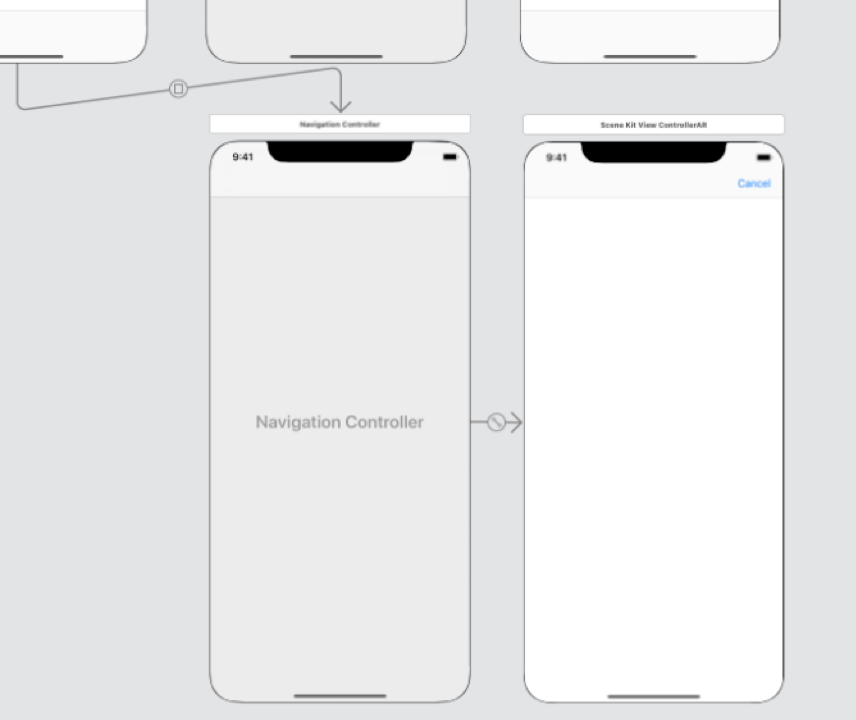

:source-highlighter: rouge
:source-language: swift
:imagesdir: ./

= Leitfaden für Mobile Training

== Aufgabe 1: Projekt anlegen & Storyboard erweitern

1. Erstelle in Xcode ein neues Swift-Projekt mit dem Namen “iOSRestaurantTableFinder".
Nutze das _Master-Detail_-Template. Das generierte Projekt enthält die komplette nötige Projekt-Struktur inklusive Storyboard. Mache dich mit der Struktur des Projekts und den einzelnen Dateien vertraut.

2. Der Name "Tischliste" soll als Titel über der Tabelle angezeigt werden.
Ergänze dazu folgende Zeile in der Methode `viewDidLoad:` des `MasterViewController`:

[source]
----
self.title = "Tischliste"
----

2. Einfügen des *Models*.

a. In der App sollen Tische verwaltet werden.
Erstelle über den Menüpunkt _File > New > File_ ein neues Swift-File, und erstelle ein `struct` mit den Attributen `number`, `name` und `createdAt`.

[source]
----
class Desk: NSObject {
    var number: Int
    var name: String?
    var createdAt: Date = Date()
}

// Alternative approach, using a computed property:
class Desk: NSObject {
    var number: Int
    // Note that you can't assign to this in the constructor;
    // instead, this is computed every time the name is accessed.
    var name: String {
        get {
            return "Tisch \(number)"
        }
    }
    var createdAt: Date = Date()
}
----

a. Füge einen Konstruktor `init()` hinzu, der den Tisch mit Nummer 1 erstellt.

[source]
----
override init() {
    self.number = 1
    self.name = "Tisch \(number)"
}
----

a. Bennene im `MasterViewController` das Attribut `objects` in `desks` um. Ändere außerdem den Typ von `[Any]` auf `[Desk]`.
_Wir nutzen hier `desks`, da `tables` bereits verwendet wird._
//TODO: Add Description, Image of Refactoring here.

a. Das Template verwendet `NSDate` als Modell-Typ an mehreren Stellen. Ändere _alle_ Vorkommen von `NSDate` im Template zu `Desk`. Außerdem muss an allen Stellen, an denen bisher das `description`-Attribut verwendet wird, dieses auf `name` geändert werden. Starte danach die App, und stelle sicher dass bei Tap auf "+" Tische hinzugefügt werden.

a. Wir wollen nun die Tischnummer hochzählen. Füge dazu zu `Desk` einen zweiten Konstruktor hinzu, der ein `Int`-Argument namens `number` erhält und als Tischnummer verwendet.

[source]
----
override init(number: Int) {
    self.number = number
    self.name = "Tisch \(number)"
}
----

a. Ändere die `insertNewObject:`-Methode im `MasterViewController` so ab, dass der neue Konstruktor aufgerufen wird und als Argument die Tischnummer des neuen Tischs übergeben bekommt. Nutze als Tischnummer hier einfach `desks.count + 1`. Probiere vor dem nächsten Schritt aus, ob der Simulator mit der Anwendung startet und dass die Tischnummern korrekt hochgezählt werden.

3. Erweiterung der Detail-Ansicht

a. Öffne `Main.storyboard` und ziehe folgende Formularelemente von der Library auf die Detailansicht:
(__Tipp: Die Library lässt sich mit dem Befehl `cmd+shift+L` öffnen.__)

- Label und Formularfeld für Tischnamen
- Label und Formularfeld für Erstellungsdatum

b. Erstelle im DetailsViewController per Drag and Drop aus dem Storyboard `Outlets` für die Formularelemente.
//TODO: Bild, genauere Beschreibung hier hinzufügen.

[source]
----
@IBOutlet weak var tableNameField: UITextField!
@IBOutlet weak var createDateField: UITextField!
----

c. Erweitere die `configureView`-Methode des `DetailViewController`, sodass der Name und das Erstellungsdatum des Tisches in den entsprechenden Feldern angezeigt werden.

[source]
----
if let detail = detailItem {
    tableNameField?.text = detail.name
    createDateField?.text = detail.createdAt.description
}
----

== Aufgabe 2: Tisch in VR-Ansicht positionieren
Erhalte vom Supervisor die Dateien assets.scnassets, `SceneKitControllerVR.swift` und `MixedRealityViewController.swift`.

_Optional: Checke Teil 2 des git-Repositories aus mit_

[source, bash]
----
git stash (oder git reset --hard HEAD)
git checkout task2
----

1. Öffne `Main.storyboard` und füge aus der Library einen `NavigationController` hinzu. Dieser hat als Standard als "RootViewController" einen `TableViewController`. Ersetze diesen durch einen normalen `ViewController`. Stelle die Verknüpfung zum `NavigationController` wieder her, indem du per Ctrl-drag-and-drop vom `NavigationController` auf den neuen `ViewController` ziehst. Wähle im aufgehenden Menü _RootViewController_ aus.

- Klicke auf den neuen ViewController und ändere in der rechten Seitenleiste im 3. Tab die Klasse auf `SceneKitControllerVR`.

- Wähle den View des neuen ViewControllers aus und ändere in der rechten Seitenleiste im 3. Tab die Klasse auf `SCNView`.

2. Wir wollen den neuen ViewController aufrufen und schließen können. 

- Öffnen: Öffne die Library und suche nach einem Button. Platziere diesen auf dem `DetailViewController`. Ändere den Text auf "Virtual Reality". Erstelle eine _Segue_ (Verknüpfung) zum neu erstellten `NavigationController` durch Ctrl-drag-and-drop. Wähle im aufgehenden Menü _Show_ aus.

- Schließen: Öffne die Library und suche nach einem Button. Platziere diesen auf dem neuen `ViewController` oben rechts innerhalb der `Navigationbar`. Ändere in der rechten Seitenleiste im 4. Tab von Xcode das _System Item_ auf _Cancel_.

    // Variante 1: Wie im Guide.
    - Verbinde den Button mit Ctrl-drag-and-drop mit der Action `dismissSceneKitView` des `SceneKitControllerVR`, damit der Button den `SceneKitControllerVR` und den `NavigationController aus der View-Hierarchie entfernt.

    // Variante 2: Mit unwind-Segue.
    - Füge folgende Methode zum `DetailViewController` hinzu:
[source]
----
@IBAction func unwind(segue: UIStoryboardSegue) {
}
----
    - Verbinde den Cancel-Button per Ctrl-drag-and-drop mit dem orangen Exit-Icon seines eigenen ViewControllers. Im aufgehenden Menü sollte `unwindWithSegue` stehen; wähle dies aus. Der Button entfernt nun bei Tap den `SceneKitControllerVR` und den `NavigationController aus der View-Hierarchie.

- Teste, ob der `SceneKitControllerVR` bei Tap auf "Virtual Reality" aufgerufen wird, eine Szene zeigt, und mit "Cancel" wieder geschlossen werden kann.
// TODO: This could be more refined.
3. Die SCNAssets enthalten Stages (RestaurantStage) und eine Menge von Objekten (Cubes, Desks). Spiele ein wenig mit dem Modelleditor und den Objekten in der RestaurantStage.scn herum und ziehe Desks und Cubes in die Stage. Nutze den Modelleditor, um 5 Tische in die RestaurantStage zu ziehen.

4. Bei Tap auf die Szene soll nun ein Tisch hinzugefügt werden. Vervollständige dazu die `setupTapGestureRecognizer` im `SceneKitControllerVR`. Wir fügen einen `UILongPressGestureRecognizer` zur `sceneView` hinzu, der bei einem langen Drücken die Methode `handleDeskGesture` ausführt.

[source]
----
private func setupTapGestureRecognizer() {
    let pressGestureRecognizer = UILongPressGestureRecognizer(target: self, action: #selector(handleDeskGesture(_:)))
    pressGestureRecognizer.minimumPressDuration = 1.0
    pressGestureRecognizer.delegate = self
    sceneView.addGestureRecognizer(pressGestureRecognizer)
}
----

== Aufgabe 3: Tisch in AR-Ansicht positionieren
Erhalte vom Supervisor die Datei `SceneKitControllerAR.swift`.

_Optional: Checke Teil 3 des git-Repositories aus mit_

[source, bash]
----
git stash (oder git reset --hard HEAD)
git checkout task3
----

1. Füge einen neuen ViewController für die AR-Ansicht hinzu. Führe dazu die Schritte 1 und 2 von Aufgabe 2 erneut aus, nur diesmal mit `SceneKitViewControllerAR` statt `VR`. Du musst im DetailViewController nicht erneut die Methode `unwind` anlegen. Der View des neuen Controllers soll den Typ `ARSCNView` haben.

2. Um auf die Kamera-Ansicht zuzugreifen muss die entsprechende Genehmigung vom Nutzer erteilt werden. Dafür muss in der `Info.plist` ein neuer Eintrag erstellt werden. Öffne die Datei und drücke z.B. bei "Executable File" auf das `-Symbol, um einen neuen Eintrag hinzuzufügen. Suche nach "Privacy - Camera Usage Description" und setze den Wert z.B. auf "Access Camera." Setze den Typ auf "String".

3. Setze die AR-Ansicht auf, indem du den `SceneKitControllerVR` bearbeitest. Erstelle ein neues Objekt für die Konfiguration der AR-Ansicht und füge es wie folgt der ARSession hinzu:
+
[source]
----
let configuration = ARWorldTrackingConfiguration()
configuration.planeDetection = .horizontal
sceneView.session.run(configuration)
----

4. *Zusatzaufgabe:* Statt dem Tisch soll ein neues Szenenobjekt verwendet werden, in etwa ein Cube oder ein anderes realistisches Szenenobjekt eines Tisches. Ersetze in der Klasse “SceneKitViewControllerAR” das Szenenmodell des Desks (verfügbar als Desk.scn) in der AR-Ansicht mit einem Cube (verfügbar als Cube.scn).