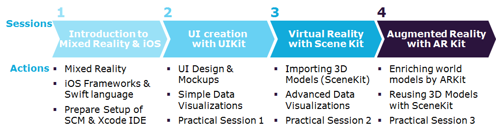

# Restaurant Desk Finder on iOS

Das Repository enthält eine Trainingsanwendung, die eine schrittweise Einführung in die iOS Programmierung bietet.

**Die Zielgruppe ist wie folgt:**

* Mobile Application Developers & Mobile Architects
* Projektleiter und Product Owners mit Interesse in AR

**Die Lernziele sind:**

* Prototyp & Erstellung der Mobile Application in iOS
* Verstehen von Mobilen Anwendungsarchitekturen in iOS Apps
* Verständnis schaffen für die Anwendungsentwicklung mit Swift

Die Lernanwendung enthält die folgenden Sessions:

Alles weitere findet sich in den Lernmaterialien im Repository.
